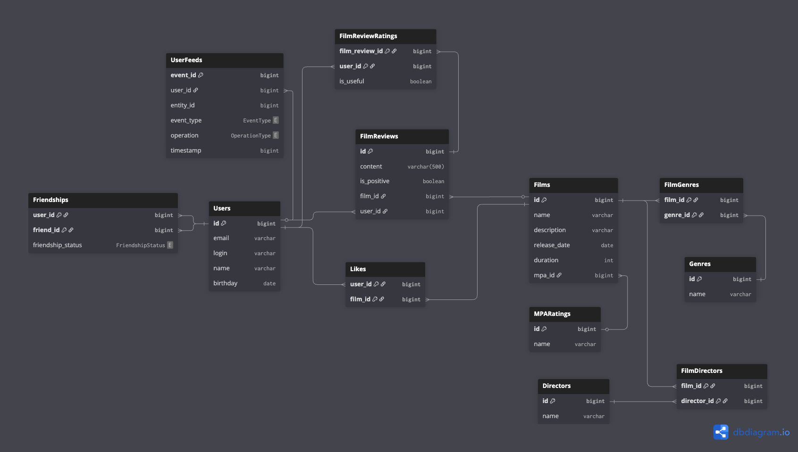

# java-filmorate

## Таблицы:

### `Users`
Хранит информацию о пользователях:
- email, логин, имя, дата рождения.

### `Films`
Хранит информацию о фильмах:
- название, описание, дата релиза, продолжительность, рейтинг MPA.

### `Genres`
Список жанров фильмов:
- комедия, драма, мультфильм и т.д.

### `MPARatings`
Справочник возрастных рейтингов MPA:
- G, PG, PG-13, R, NC-17.

### `FilmGenres`
Связь между фильмами и жанрами (многие ко многим).

### `Friendships`
Связь дружбы между пользователями:
- содержит статус (`AWAITING`, `APPROVED`).

### `Likes`
Лайки фильмов от пользователей.